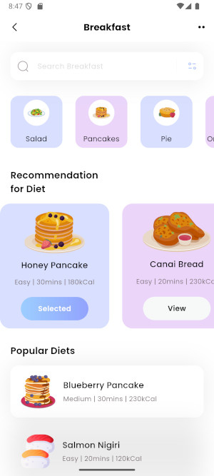

# Cakes With Prompts (Quick Prototype)

## Summary

A quick prototype of a cross platform application with some of the commonly used mobile UI elements.

This application features a dynamic home screen that displays:
*   A search bar for finding specific items (e.g., breakfast recipes).
*   A horizontally scrollable list of categories (e.g., Salad, Cake, Pie, Smoothies).
*   A section for recommended diet plans, each with details like level, duration, and calorie information.
*   A list of popular diets that users can interact with.

## Tech Stack

*   **Framework:** Flutter
*   **Language:** Dart
*   **State Management:** `setState` (based on the provided `home_page.dart`)
*   **UI Components:**
    *   Material Design Widgets (Scaffold, AppBar, ListView, Container, Text, etc.)
    *   `flutter_svg` for rendering SVG images.
*   **Linting/Formatting:**
*   **Testing:** Flutter test 

## Features Implemented (in `home_page.dart`)

*   **Search Functionality:** A search field allows users to input search terms.
*   **Categorized Browsing:** Displays various food or diet categories in a horizontal list.
*   **Diet Recommendations:** Shows a horizontally scrollable list of recommended diets with details and an interactive "View"/"Selected" button.
*   **Popular Diets:** Lists popular diet plans, allowing users to select/deselect them.
*   **Dynamic UI Updates:** The UI reflects user interactions, such as selecting a diet plan or tapping on a popular diet.

